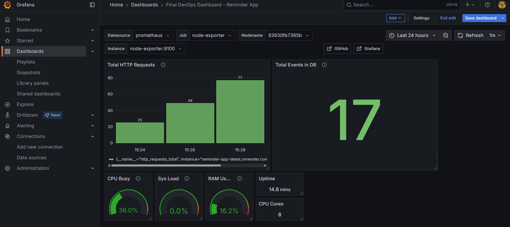
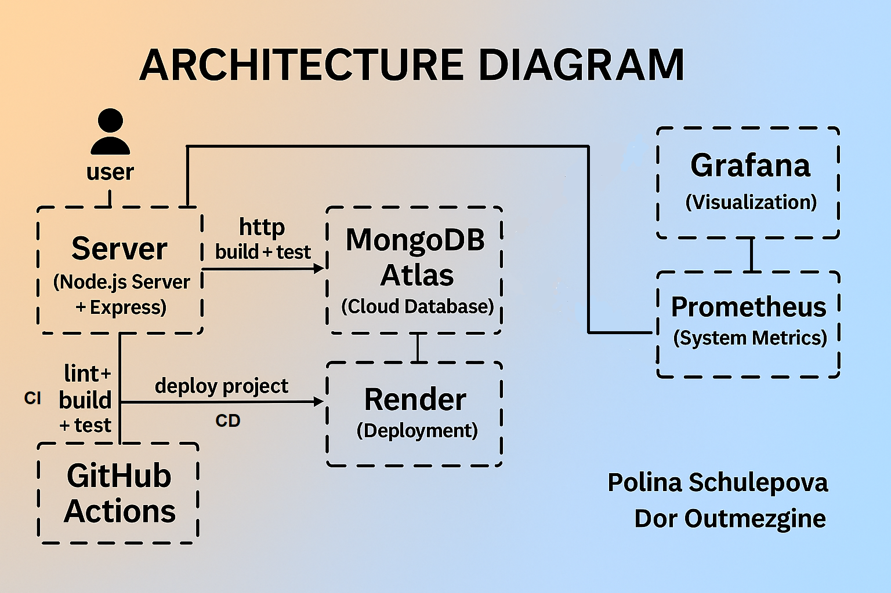

# DevOps Final Project – Event Reminder App

This project is part of our final assignment in the DevOps course.
It's a backend web service called Event Reminder, where users can create and view event reminders.

The main focus was on implementing a complete DevOps workflow, including CI/CD pipelines with GitHub Actions, Docker containerization, and deployment to Render.

We also added monitoring using Prometheus, collecting metrics from both the app and the system (using Node Exporter), and visualized them in Grafana through a custom dashboard.

The backend is built with Node.js and Express, and connects to a cloud-hosted MongoDB Atlas database. The system includes unit tests and exposes real-time metrics for observability.

- GitHub Repository:[https://github.com/PolinaShchulepova/Devops_FinalProject](https://github.com/PolinaShchulepova/Devops_FinalProject)

- Render URL: https://reminder-app-latest.onrender.com/events


# Project Structure

app.js
index.js
routes/events.js
models/schema.js
tests/test.js
Dockerfile
docker-compose.yml
prometheus.yml
.github/workflows/ci.yml | cd.yml
.env
README.md


# Technologies Used

- Node.js + Express
- MongoDB Atlas
- Jest + Supertest (for testing)
- Docker & Docker Compose
- GitHub Actions (CI & CD pipelines)
- Prometheus + Grafana
- Prom-client (for custom metrics)
- DockerHub
- ESLint (code quality & linting)


### Runing the Project Locally

# Prerequisites

- Docker
- postman or curl
- vs code

# Run Locally with Monitoring

```bash
docker compose up --build
```

Services:
- Web App: http://localhost:3000/events
    Displays all saved reminders in JSON format
    You can also add a new event by sending a POST request using Postman
    {
        "title": "Test Event",
        "date": "2025-08-01",
        "time": "10:00"
    }

- Prometheus: http://localhost:9090
    Prometheus is used to collect and query metrics from the app and the system.  
  To explore metrics:
  1. In the search bar, start typing a metric name (`http_requests_total`, `total_events_in_db`,`node_cpu_seconds_total`...)
  2. click Execute
  3. You can switch to "Graph" view to see a live chart of the selected metric
    In the Target Health section of Prometheus, you can see the status of all services being monitored.  
    This includes:
    `event-reminder-app`: the deployed web application on Render.
    `grafana`: the Grafana container itself.
    `node-exporter`: the system metrics exporter.
    All targets show the status **UP**, which means Prometheus is successfully connected to them and collecting metrics in real time.

- Grafana: http://localhost:3001
    Go to Dashboards → Import
    Upload the file grafana-dashboard.json located in the root of this project
    Click Import and the dashboard will be visible

- Node Exporter: http://localhost:9100
    This page displays system metrics exposed by Node Exporter


# Running the Tests

To run automated tests:

```bash
npm install
npm test
```

Tests cover:
#Getting a list of all events
#Adding new events
#Making sure the app returns the right errors when fields are missing or invalid


### CI/CD Pipelines

# CI – Continuous Integration


Implemented via GitHub Actions:
- Runs on each Pull Request to `main`
- Performs:
  - ESLint code linting
  - Unit tests with Jest
  - Docker build validation

# CD – Continuous Deployment


Triggered on each push to `main`:
- Builds and pushes Docker image to Docker Hub
- Triggers a deployment on Render using a deploy hook URL stored as a GitHub Secret.


## Monitoring and Observability

# Metrics Exposed

- `/metrics` endpoint exposes:
  - `http_requests_total`
  - `total_events_in_db`

# Grafana Dashboards

Custom dashboards created to visualize:
- Total HTTP Requests
- Number of Events in DB
- Node Exporter system metrics :

 Dashboard is exported and saved as JSON in the repository.

 

# Team Contribution

Polina Shchulepova:
- CI Setup (ESLint, Unit Tests, Docker Build)
- Application logic and Express routes
- tests
- Docker Compose configuration
- Metrics Integration with Prometheus

Dor Outmezgine:
- Application logic and Express routes
- Created a Dockerfile to containerize the app
- Built the Docker image and pushed it to Docker Hub
- CD pipeline to Docker Hub and Render
- Grafana Dashboard creation and export
- README file


# Data Persistence

- Data is stored in MongoDB Atlas
- Metrics are stored in Prometheus
- Dashboards in Grafana (saved as JSON in repo)


# Architecture Diagram



